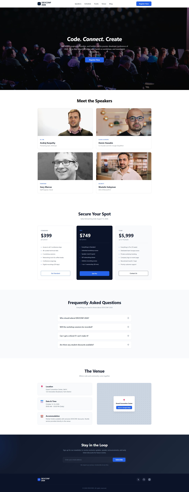

# 🚀 DEVCONF 2026 - Developer Conference Landing Page

DEVCONF 2026 is a modern, clean, and fully responsive landing page designed for a premier developer conference. It features a sleek dark hero section, a speakers showcase, dynamic pricing tables, an interactive pure-CSS FAQ section, venue details, and a newsletter subscription area.



## ✨ Features

* **Modern Hero Section:** Eye-catching banner with a full-screen background image, crisp typography, and dark overlay styling.
* **Speakers Grid:** A responsive 2-column grid layout with smooth hover transition effects for speaker profile cards.
* **Dynamic Pricing Cards:** Three distinct tier plans (Standard, Pro, and Team) styled beautifully using CSS Flexbox with custom feature bullet lists.
* **Pure CSS Accordion (FAQ):** Interactive accordion functionality built using the **"Checkbox Hack"** ($+$/$~$/`:checked` selectors). Works perfectly without a single line of JavaScript!
* **Creative Venue Layout:** Emoji-integrated info cards coupled with a sleek dot-matrix styled map placeholder featuring animated location pins.
* **Newsletter Signup:** A clean email subscription form protected with default submit preventions, ready to connect to a backend api.
* **100% Responsive Design:** Tailored with CSS Media Queries to provide a pixel-perfect user experience across desktops, tablets, and smartphones.

## 🛠️ Tech Stack

* **HTML5:** Built with semantic structural elements (`<header>`, `<main>`, `<section>`, `<footer>`) for great SEO and accessibility.
* **CSS3:** Built completely from scratch without external frameworks (No Tailwind/Bootstrap). Implements custom CSS Grid, Flexbox, transitions, keyframe animations, and pseudo-elements (`::before`/`::after`).

## 📁 Project Structure

```text
├── assets/
│   ├── logo.png
│   ├── footer-logo.png
│   ├── banner.jpg
│   ├── andrej.png
│   ├── demis.png
│   ├── gary.png
│   └── mustafa.png
├── index.html
├── style.css
└── README.md